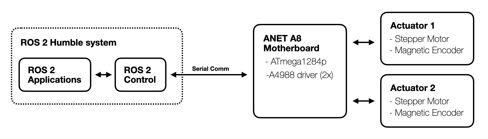

## Introduction

This repository presents a complete example of how to repurpose an **ANET A8 3D printer motherboard** into a functional actuator system for a differential drive robot, fully integrated with the **ROS 2 control framework** (`ros2_control`). It provides both the **firmware** that runs on the microcontroller and the **hardware interface plugin** required to bridge the physical system with the ROS 2 ecosystem.

This project serves two main purposes:

1. **Hardware Repurposing Reference**: It provides a practical, working example of how inexpensive 3D printer electronics can be reused in robotics applications.
2. **ROS 2 Control Integration Example**: It offers a minimal but complete implementation of a custom hardware plugin for `ros2_control`, useful as a reference or learning resource.


The actuator system is composed of **two stepper motors**, each equipped with an **AS5600 absolute magnetic encoder** to track shaft position. The motors are driven by **A4988 stepper drivers** onboard the ANET A8 motherboard. The board uses an **Atmega1284p microcontroller**, which is compatible with the Arduino toolchain through the [Sanguino board definition](https://github.com/Lauszus/Sanguino), although it is not officially supported by the Arduino IDE.

All communication between the robot and the ROS 2 computer occurs over a **serial connection**, with velocity commands sent to the microcontroller and encoder data streamed back to the host. A **custom `SystemInterface` plugin** for `ros2_control` implements this logic, enabling real-time control and feedback integration.


**Figure 1:** System architecture overview. Two stepper actuators with magnetic encoders are driven by an ANET A8 3D printer board running custom firmware. The board communicates via serial with a ROS 2 Humble system, which uses ros2_control to manage real-time control and feedback integration.


<div style="display: flex; gap: 20px;">

  <div style="flex: 1;">
    <h3>Software Stack</h3>
    <table>
      <tr><th>Component</th><th>Description</th></tr>
      <tr><td><b>ROS 2 Humble</b></td><td>Target ROS 2 distribution</td></tr>
      <tr><td><code>ros2_control</code></td><td>Hardware abstraction & real-time control</td></tr>
      <tr><td><code>diff_drive_controller</code></td><td>Velocity command + odometry</td></tr>
      <tr><td><code>joint_state_broadcaster</code></td><td>Publishes joint states</td></tr>
      <tr><td><b>Launch & Config</b></td><td>YAML + launch files</td></tr>
    </table>
  </div>

  <div style="flex: 1;">
    <h3>Repository Contents</h3>
    <table>
      <tr><th>Path</th><th>Description</th></tr>
      <tr><td><code>src/, include/</code></td><td>C++ hardware plugin implementation</td></tr>
      <tr><td><code>description/urdf/</code></td><td>Xacro robot description</td></tr>
      <tr><td><code>config/</code></td><td>Controller YAML config</td></tr>
      <tr><td><code>launch/</code></td><td>System bringup launch files</td></tr>
      <tr><td><code>firmware/</code></td><td>Atmega1284p firmware source</td></tr>
    </table>
  </div>

</div>


The system is tested and functional. It supports closed-loop velocity control, publishes joint states, integrates cleanly with the ROS 2 navigation stack, and can be driven using tools such as `teleop_twist_keyboard` or custom commands. This setup is a solid foundation for building more complex mobile robots or for learning how to write real `ros2_control` hardware interfaces from scratch.

---

## Installing the Hardware Plugin

This section provides instructions for installing and using the custom hardware plugin developed for the `ros2_control` framework. It assumes a working installation of **ROS 2 Humble** and basic familiarity with ROS 2 concepts. Firmware installation for the ANET A8 board is addressed in a later section.

Begin by cloning this repository into the `src/` directory of your ROS 2 workspace:

```bash
cd ~/ros2_ws/src
git clone -b humble https://github.com/ricdigi/ros2_dual_stepper_controller.git
```

Next, ensure that all required system dependencies are installed. The plugin relies on core components of the ROS 2 control stack, including controller management and joint state broadcasting:

```bash
sudo apt install ros-humble-ros2-control \
                 ros-humble-ros2-controllers \
                 ros-humble-diff-drive-controller \
                 ros-humble-joint-state-broadcaster \
                 ros-humble-controller-manager \
                 ros-humble-robot-state-publisher \
                 ros-humble-xacro
```

Optional tools for manual control and visualization can be installed with:

```bash
sudo apt install ros-humble-teleop-twist-keyboard \
                 ros-humble-rviz2
```

After installing system packages, use `rosdep` to resolve any remaining ROS-specific dependencies:

```bash
cd ~/ros2_ws
rosdep install --from-paths src --ignore-src -r -y
```

Finally, build the workspace. Ensure your ROS 2 environment is properly sourced before compiling:

```bash
source /opt/ros/humble/setup.bash
colcon build --symlink-install
```

Once the build completes, source the workspace:

```bash
source install/setup.bash
```

You are now ready to launch and test the system.

## Launching the System
To bring up the dual stepper controller system, use the provided launch files. The main launch file is located in `launch/dual_stepper_controller.launch.py`. This file sets up the necessary nodes and configurations for the hardware interface, controllers, and robot state publisher. Moreover, it launches rviz2 for visualization and debugging.

Run the following command to start the system:

```bash
ros2 launch ros2_dual_stepper_controller test_hardware.launch.py
```

Note: the system will run only if the ANET A8 board is connected via USB and the firmware is correctly installed and running (see the Firmware section below).

## Installing the Firmware on the ANET A8 Board

The firmware is written in C++, and integrating some Arduino library syntax, for the **Atmega1284p** microcontroller on the ANET A8 motherboard. It implements a minimal serial protocol to receive velocity commands from the ROS 2 host and return encoder readings from the attached AS5600 sensors.

### Requirements

The firmware is designed to be compiled and uploaded using **PlatformIO**. To install PlatformIO, follow the instructions on the [official website](https://platformio.org/install/cli). A working Python installation is required. Moreover, make sure to install the shell commands.

### Uploading the Firmware

1. Navigate to the `firmware/` directory:

   ```bash
   cd firmware
   ```

2. Open the `platformio.ini` file and set the correct USB upload port:

   ```ini
   upload_port = /dev/ttyUSB0  ; or COM3 on Windows
   ```

3. Compile and upload the firmware:

   ```bash
   platformio run --target upload
   ```

After upload, the microcontroller will automatically reset and start listening for velocity commands over the specified serial port. Ensure that the serial port specified here matches the one configured in your ROS 2 `<ros2_control>` URDF tag.

